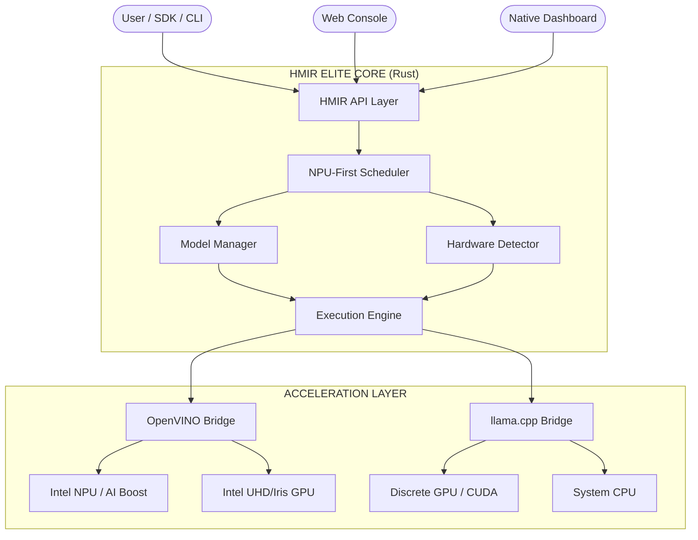

# HMIR: Heterogeneous Model Inference Runtime


> **The Universal Local Inference Engine for the AI PC Era.**
>
> HMIR (Heterogeneous Model Inference Runtime) is a unified, production-grade inference platform designed to orchestrate Large Language Models across **NPU, GPU, and CPU**. With an **NPU-first** scheduling philosophy, HMIR maximizes battery life and system responsiveness while providing transparent, high-performance fallback to discrete or integrated graphics.

---

## 🌟 The HMIR Advantage

Local LLM deployment is often a trade-off between performance and efficiency. HMIR eliminates this friction by providing a **single, hardware-aware abstraction layer** that handles the complexities of modern silicon.

- **🚀 NPU-First Execution**: Automatically targets Intel AI Boost (NPU) and Apple Neural Engine (ANE) for ultra-low power background inference.
- **🛡️ Intelligent Fallback**: If the primary accelerator is overloaded or incompatible, HMIR seamlessly spills over to the GPU or CPU.
- **🔌 OpenAI Compatible**: A drop-in replacement for any application using the OpenAI SDK. Use your favorite tools (Cursor, Open WebUI, etc.) with local silicon.
- **📊 Unified Telemetry**: Real-time visibility into NPU, GPU, and CPU utilization through the `hmir smi` tool and native dashboards.
- **⚡ Self-Healing Runtime**: Automatic recovery from port conflicts, stale hardware caches, and corrupt model weights.
- **🤫 Silent Background Mode**: Optimized for Windows with zero-window execution (no PowerShell flickers) for all background workers.

---

## 🏗️ Hardware Scope & Architecture

HMIR is built for the "AI PC" generation. It doesn't just run on your hardware; it understands it.

### 🧠 Deep Silicon Integration

| Vendor | Component | Optimization Stack | Primary Engine |
| :--- | :--- | :--- | :--- |
| **Intel** | Core Ultra NPU / Arc GPU | OpenVINO | `ov-npu` / `ov-gpu` |
| **Apple** | Neural Engine / M-Series GPU | Core ML / Metal | `metal` / `ane` |
| **NVIDIA** | RTX Tensor Cores | TensorRT / CUDA | `cuda` |
| **AMD** | Ryzen AI / Radeon GPU | MIGraphX / ROCm | `rocm` |
| **Qualcomm** | Hexagon NPU | QNN / SNPE | `qnn` |

### 📊 Model Compatibility Matrix

To get the best performance, use models optimized for your specific silicon:

| Optimization | Target Hardware | Recommended Backend | Suffix Hint |
| :--- | :--- | :--- | :--- |
| **OpenVINO (INT4/8)** | Intel NPU / iGPU | `hmir-sys-ov` | `-ov` |
| **GGUF (Q4_K_M/Q8)** | NVIDIA GPU / Apple / CPU | `hmir-sys-llama` | `.gguf` |
| **MLX / CoreML** | Apple Silicon | `hmir-sys-apple` | `-mlx` |
| **TensorRT** | NVIDIA RTX | `hmir-sys-trt` | `-trt` |

---

## 🏗️ Technical Architecture

HMIR is structured as a multi-tier orchestration layer, ensuring that high-level API logic remains decoupled from low-level hardware drivers.

1. **The Orchestrator (`hmir-core`)**: Handles telemetry aggregation, NPU-first scheduling, and model lifecycle management.
2. **The Execution Bridges (`hmir-sys`)**: Lean, specialized worker processes that wrap vendor SDKs (OpenVINO, llama.cpp, etc.).
3. **The Control Plane (`hmir-cli` & `hmir-dashboard`)**: Provides high-fidelity monitoring and persistent configuration management.



## 🛠️ Self-Healing & Maintenance

HMIR is designed for **Zero-Touch Maintenance**. It includes several self-healing mechanisms to ensure high availability:

- **Automatic Cache Recovery**: If a model load fails due to a corrupt OpenVINO cache, HMIR automatically purges the stale cache and retries, preventing "stuck" engine states.
- **Port Conflict 'Attach'**: If you try to `hmir start` when a node is already running, the CLI gracefully attaches to the existing instance instead of failing.
- **Ghost Process Termination**: `hmir start` now automatically cleans up stale processes on ports 8080 and 8089 to ensure a fresh, stable startup.
- **System Purge**: Use `hmir clean` to manually reset all hardware acceleration caches if you experience instability after a driver update.

## 📦 Installation

### Windows (One-Click Installer)

Open PowerShell as Administrator and run:

```powershell
irm https://raw.githubusercontent.com/bhattkunalb/HMIR/main/scripts/install.ps1 | iex
```

This script handles dependency checks, environment isolation, and creates a desktop shortcut for the **HMIR Dashboard**.

### Manual / Developer Setup

1. Clone the repository: `git clone https://github.com/bhattkunalb/HMIR`
2. Install Python dependencies: `pip install -r requirements.txt`
3. Build the CLI: `cargo build --release -p hmir-cli`

---

## 🚀 Quick Start

### 1. Probe the machine

Automatically detect your silicon and get tailored model recommendations:

```bash
hmir suggest
```

### 2. Pull a compatible model

```bash
# Intel NPU-friendly OpenVINO pack
hmir pull qwen2.5-1.5b-ov

# Cross-platform GGUF fallback
hmir pull llama3.2-3b
```

### 3. Start the local API + Web Console

```bash
hmir start --model qwen2.5-1.5b-ov
```

This starts the API server and the **Native Desktop Dashboard**.

### 3a. Headless mode (API only, no UI)

```bash
hmir start --headless --model qwen2.5-1.5b-ov
```

### 3b. Monitor Status & Hardware

```bash
hmir status
hmir smi
hmir stop
```

- `status`: High-level health and active model info.
- `smi`: Detailed per-device utilization (NPU/GPU/CPU) and live process activity.
- `stop`: Gracefully terminates all background inference nodes and worker services.

This opens the high-fidelity **System Management Interface** to monitor your silicon in real-time.

### 3d. Source Build Execution

If you are developing or prefer to run directly from source instead of using the installed `hmir` binary, you can use Cargo:

```bash
cargo run --release -p hmir-cli -- start
```

### 4. Call the OpenAI-compatible endpoint

```bash
curl http://127.0.0.1:8080/v1/chat/completions \
  -H "Content-Type: application/json" \
  -d '{
    "messages": [{"role": "user", "content": "Summarize the active hardware route."}],
    "stream": true
  }'
```

### 5. Download a model (CLI)

```bash
hmir download OpenVINO/qwen2.5-1.5b-instruct-int4-ov
```

Progress bars show download speed, ETA, and percentage completion.

### 6. Clean runtime caches

```bash
hmir clean
```

Purges stale OpenVINO and hardware acceleration caches to resolve loading errors.

## How It Works

1. HMIR probes the machine and discovers available `NPU`, `GPU`, and `CPU` targets.
2. The model manager resolves which backends can actually load the requested model package.
3. The scheduler scores candidate plans using device capability, memory headroom, queue depth, and latency intent.
4. The execution engine runs the highest-scoring plan.
5. If a device is unavailable or overloaded, HMIR retries on the next fallback path.
6. Logs and telemetry show which backend and device handled the request.

## Web Console

The browser-based web console is available at `http://localhost:8080` when the API is running. It provides:

- **📊 Overview** — Real-time hardware gauges (CPU, GPU, NPU, RAM), inference engine status, tokens/sec
- **💬 Chat** — Streaming chat with the NPU-powered model, persistent history via localStorage
- **🧠 Models** — List installed models, load/eject models, download new models from HuggingFace
- **📋 Logs** — Live system log stream with search/filter
- **🔗 Connect** — Copy-paste API endpoints for Cursor, VS Code, Open WebUI, and other tools

## Native Dashboard

The desktop dashboard is the main local control plane:

- native chat is built in
- model mount and unmount controls are built in
- download and model-folder access are built in
- integration access details are built in
- advanced log viewing is built in

```bash
hmir start --dashboard
```

## Integrations

HMIR is designed to act like a local OpenAI-compatible provider.

```bash
hmir integrations
```

That command prints the base URL, API key suggestion, and model hints you can reuse in tools such as:

- Cursor
- VS Code extensions that support custom OpenAI endpoints
- OpenClaw
- OpenJarvis
- Antigravity
- Open WebUI
- custom Python and JavaScript OpenAI SDK clients

Default local API values:

- Base URL: `http://127.0.0.1:8080/v1`
- API key: `hmir-local` (no auth required)

## API Endpoints

| Method | Endpoint | Description |
| --- | --- | --- |
| `GET` | `/` | Web Console |
| `POST` | `/v1/chat/completions` | OpenAI-compatible chat (streaming) |
| `GET` | `/v1/models/installed` | List installed models |
| `POST` | `/v1/models/download` | Download a model |
| `POST` | `/v1/engine/switch` | Switch active model |
| `POST` | `/v1/engine/eject` | Eject a model |
| `GET` | `/v1/telemetry` | SSE telemetry stream |
| `GET` | `/v1/logs` | SSE log stream |
| `GET` | `/v1/health` | Health check |

## Logs

Use the CLI log tools for quick inspection:

```bash
hmir logs --tail 200
hmir logs --grep ERROR
hmir logs --follow
```

Or use the web console's **Logs** tab for live, filterable log viewing.

## 🔍 Troubleshooting NPU Usage

If your hardware isn't behaving as expected, check these common scenarios:

### 1. Task Manager shows 0% NPU

Windows Task Manager often fails to capture high-frequency burst OpenVINO GenAI workloads. Use the **HMIR Dashboard** telemetry for the most accurate view of NPU utilization.

### 2. Model Loading Errors

If a model fails to mount, it is often due to a stale backend cache. Run:

```bash
hmir clean
```

### 3. Driver Requirements

- **Intel NPU**: Requires driver version `31.0.100.xxxx` or higher.
- **NVIDIA**: Requires CUDA `12.x` for optimal GGUF acceleration.

### 4. Background Window Flickering

HMIR Elite uses the `CREATE_NO_WINDOW` flag for all background PowerShell and Python processes. If you still see windows opening/closing, ensure you are running the latest version:

```bash
irm https://raw.githubusercontent.com/bhattkunalb/HMIR/main/scripts/install.ps1 | iex
```

### 5. Cleaning System File "Noise"

If you see system files (like `.bin` firmware) in your model list, HMIR has been updated to ignore them. It now only scans:

- `C:\Users\<User>\.hmir\models`
- `AppData\Local\hmir\models`
- Explicit `.gguf` files.

---

## MVP Scope

The intended MVP is deliberately focused:

- automatic hardware detection
- `NPU -> GPU -> CPU` fallback
- OpenVINO + llama.cpp backend support
- simple CLI + API server
- model auto-loading
- device-selection logs

Not in the first cut:

- distributed multi-node serving
- complex tensor-parallel orchestration
- learned routing models

## Roadmap

- `v0.1`: hardware detection, backend registry, model manifests
- `v0.2`: NPU-first scheduler and transparent fallback
- `v0.3`: request-level load balancing and better warm-model residency
- `v0.4`: speculative draft plans and adaptive scoring
- `v1.0`: stable cross-platform serving runtime with clear backend contracts

## Repository Layout

- `hmir-api`: API server, streaming surface, and web console
- `hmir-core`: orchestration, scheduler, memory, telemetry
- `hmir-hardware-prober`: cross-platform hardware detection (CPU, GPU, NPU, RAM)
- `hmir-dashboard`: native desktop dashboard (egui)
- `hmir-sys`: low-level backend bindings and adapters
- `deploy/packaging/hmir-cli`: CLI entrypoint
- `scripts`: installation, model downloads, and backend helpers

## Contributing

Contributions are welcome. Start with [CONTRIBUTING.md](CONTRIBUTING.md), then read [docs/ARCHITECTURE.md](docs/ARCHITECTURE.md) for the target system design and scheduler direction.
