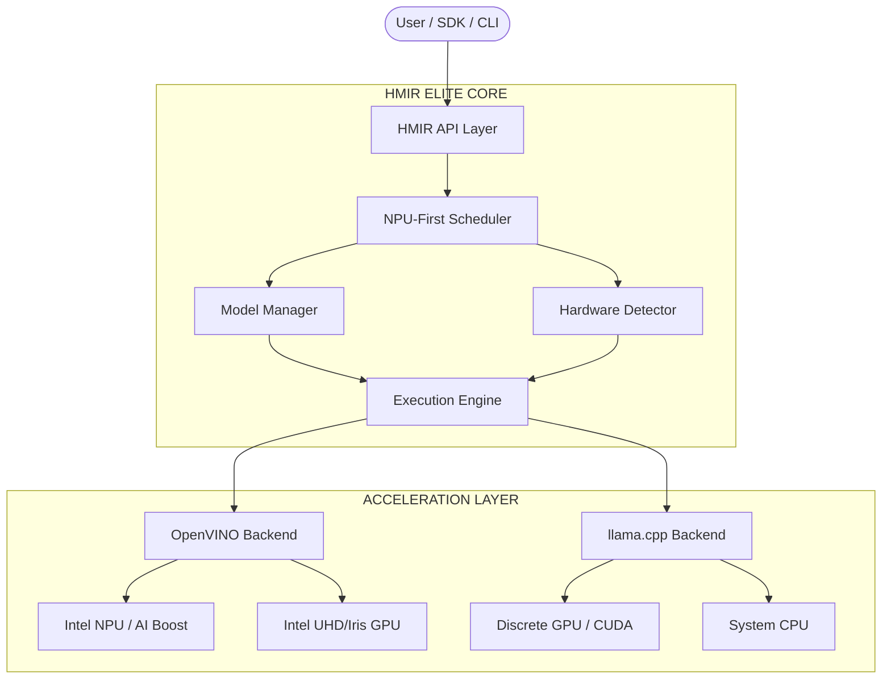

# HMIR


> Run one local LLM service across NPU, GPU, and CPU with NPU-first scheduling and automatic fallback.

HMIR is a heterogeneous local inference runtime for Windows, Linux, and macOS. It detects the hardware available on the machine, selects the best backend for the requested model, and exposes one developer-friendly API instead of forcing users to hand-pick devices and runtimes.

The design goal is simple:

- prefer `NPU` when it is available and the model fits
- fall back to `GPU`, then `CPU`, without manual reconfiguration
- keep the serving surface OpenAI-compatible
- make backend choice visible and explainable

Full production architecture: [docs/ARCHITECTURE.md](docs/ARCHITECTURE.md)

## One-Command Install

### Windows

```powershell
irm https://raw.githubusercontent.com/bhattkunalb/HMIR/main/scripts/install.ps1 | iex
```

### Linux

```bash
curl -fsSL https://raw.githubusercontent.com/bhattkunalb/HMIR/main/scripts/install.sh | bash
```

### macOS

```bash
curl -fsSL https://raw.githubusercontent.com/bhattkunalb/HMIR/main/scripts/install.sh | bash
```

After install, HMIR probes local hardware automatically and routes across `NPU`, `GPU`, and `CPU`.

## Hardware Scope

HMIR is not intended to be Intel-only.

- `Intel`: OpenVINO-friendly NPU, Intel GPU, CPU
- `NVIDIA`: CUDA-capable GPU fallback plus CPU
- `AMD`: GPU fallback plus CPU, with room for vendor-specific NPU integrations
- `Apple Silicon`: Metal / MLX-style future path plus CPU
- `Qualcomm / AI PC NPUs`: targeted through pluggable backend support
- `CPU-only systems`: supported as a first-class fallback

## Problem

Local LLM stacks are still fragmented:

- one runtime is great on `Intel NPU` but weak elsewhere
- another is strong on `CUDA` but ignores `NPU`
- CPU fallback often becomes a separate workflow
- developers end up choosing devices manually instead of targeting one local service

That is the gap HMIR is designed to close.

## Solution

HMIR combines:

- a `device capability detector`
- a `scheduler` that scores NPU, GPU, and CPU plans
- a `backend abstraction layer` for runtimes like `OpenVINO` and `llama.cpp`
- a `model manager` that tracks compatible model packages
- an `execution engine` that runs the selected plan
- an `OpenAI-compatible API layer`

## Features

- cross-platform target: `Windows`, `Linux`, `macOS`
- cross-hardware target: `NPU`, `GPU`, `CPU`
- `NPU-first` scheduling with transparent fallback
- pluggable backends instead of hard-coded device logic
- request-level load balancing across available devices
- native dashboard with built-in chat, controls, integrations, and logs
- simple CLI for suggest, pull, serve, logs, and integration flows
- OpenAI-compatible `/v1/chat/completions`
- explicit logging of selected backend and device

## 🏗️ Architecture



## 🚀 Model Matrix

| HW Target | Preferred Format | Engine | Example Alias |
| --- | --- | --- | --- |
| **Intel NPU** | OpenVINO IR | `OpenVINO` | `qwen2.5-1.5b-ov` |
| **Intel iGPU** | OpenVINO IR | `OpenVINO` | `phi3-mini-ov` |
| **NVIDIA GPU** | GGUF | `llama.cpp` | `llama3.2-3b` |
| **Apple ANE** | CoreML / GGUF | `llama.cpp` | `phi3-mini` |
| **System CPU** | GGUF | `llama.cpp` | `llama3-8b-gguf` |

Rule:

- use `OpenVINO IR` packs with `OpenVINO`
- use `GGUF` packs with `llama.cpp`

## Quick Start

### 1. Probe the machine

```bash
hmir suggest
```

### 2. Pull a compatible model

```bash
# Intel NPU-friendly OpenVINO pack
hmir pull qwen2.5-1.5b-ov

# Cross-platform GGUF fallback
hmir pull llama3.2-3b
```

### 3. Start the local API

```bash
hmir start --port 8080 --model qwen2.5-1.5b-ov
```

### 3a. Start the native dashboard with built-in chat

```bash
hmir start --dashboard --model qwen2.5-1.5b-ov
```

### 4. Call the OpenAI-compatible endpoint

```bash
curl http://127.0.0.1:8080/v1/chat/completions \
  -H "Content-Type: application/json" \
  -d '{
    "messages": [{"role": "user", "content": "Summarize the active hardware route."}],
    "stream": true
  }'
```

## How It Works

1. HMIR probes the machine and discovers available `NPU`, `GPU`, and `CPU` targets.
2. The model manager resolves which backends can actually load the requested model package.
3. The scheduler scores candidate plans using device capability, memory headroom, queue depth, and latency intent.
4. The execution engine runs the highest-scoring plan.
5. If a device is unavailable or overloaded, HMIR retries on the next fallback path.
6. Logs and telemetry show which backend and device handled the request.

## Dashboard

The desktop dashboard is intended to be the main local control plane, not a launcher that immediately pushes you back to the browser.

- native chat is built in
- model mount and unmount controls are built in
- download and model-folder access are built in
- integration access details are built in
- advanced log viewing is built in

If you want the browserless flow, use:

```bash
hmir start --dashboard
```

If you want a headless API for editors and agents, use:

```bash
hmir start --no-browser
```

## Integrations

HMIR is designed to act like a local OpenAI-compatible provider.

```bash
hmir integrations
```

That command prints the base URL, API key suggestion, and model hints you can reuse in tools such as:

- Cursor
- VS Code extensions that support custom OpenAI endpoints
- OpenClaw
- OpenJarvis
- Antigravity
- Open WebUI
- custom Python and JavaScript OpenAI SDK clients

Default local API values:

- Base URL: `http://127.0.0.1:8080/v1`
- API key: `hmir-local`

## Logs

Use the CLI log tools for quick inspection:

```bash
hmir logs --tail 200
hmir logs --grep ERROR
hmir logs --follow
```

## MVP Scope

The intended MVP is deliberately focused:

- automatic hardware detection
- `NPU -> GPU -> CPU` fallback
- OpenVINO + llama.cpp backend support
- simple CLI + API server
- model auto-loading
- device-selection logs

Not in the first cut:

- distributed multi-node serving
- complex tensor-parallel orchestration
- learned routing models

## Roadmap

- `v0.1`: hardware detection, backend registry, model manifests
- `v0.2`: NPU-first scheduler and transparent fallback
- `v0.3`: request-level load balancing and better warm-model residency
- `v0.4`: speculative draft plans and adaptive scoring
- `v1.0`: stable cross-platform serving runtime with clear backend contracts

## Repository Layout

- `hmir-api`: API server and streaming surface
- `hmir-core`: orchestration, scheduler, memory, telemetry
- `hmir-hardware-prober`: cross-platform hardware detection
- `hmir-sys`: low-level backend bindings and adapters
- `deploy/packaging/hmir-cli`: CLI entrypoint
- `scripts`: installation and transitional backend helpers

## Contributing

Contributions are welcome. Start with [CONTRIBUTING.md](CONTRIBUTING.md), then read [docs/ARCHITECTURE.md](docs/ARCHITECTURE.md) for the target system design and scheduler direction.
