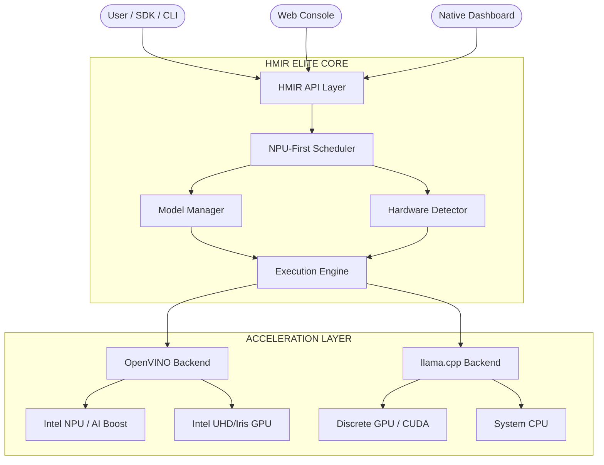

# HMIR


> Run one local LLM service across NPU, GPU, and CPU with NPU-first scheduling and automatic fallback.

HMIR is a heterogeneous local inference runtime for Windows, Linux, and macOS. It detects the hardware available on the machine, selects the best backend for the requested model, and exposes one developer-friendly API instead of forcing users to hand-pick devices and runtimes.

## Troubleshooting NPU Usage

If Windows Task Manager shows **0% NPU** usage while you are chatting:

1. **Check HMIR Dashboard**: The HMIR Dashboard (native and web) tracks the internal engine state. If the dashboard shows high NPU utilization, the NPU is active.
2. **Task Manager Limitation**: Windows Task Manager often fails to capture bursty OpenVINO GenAI workloads because the NPU execution happens in micro-bursts that are faster than the Task Manager polling rate.
3. **Model Compatibility**: Ensure you are using a `-ov` (OpenVINO) model. GGUF models run on CPU/GPU via llama.cpp and will not utilize the NPU.
4. **NPU Drivers**: Ensure you have the latest Intel NPU drivers (version 31.0.100.xxxx or higher).

---

## Command Reference

The design goal is simple:

- prefer `NPU` when it is available and the model fits
- fall back to `GPU`, then `CPU`, without manual reconfiguration
- keep the serving surface OpenAI-compatible
- make backend choice visible and explainable

Full production architecture: [docs/ARCHITECTURE.md](docs/ARCHITECTURE.md)

## One-Command Install

### Windows

```powershell
irm https://raw.githubusercontent.com/bhattkunalb/HMIR/main/scripts/install.ps1 | iex
```

### Linux / macOS

```bash
curl -fsSL https://raw.githubusercontent.com/bhattkunalb/HMIR/main/scripts/install.sh | bash
```

The installer will:

1. Install Rust toolchain (if not present)
2. Create a Python virtual environment with OpenVINO GenAI dependencies
3. Build the Web Console static assets
4. Build all HMIR binaries from source
5. Add `hmir` to your PATH

After install, HMIR probes local hardware automatically and routes across `NPU`, `GPU`, and `CPU`.

## Hardware Scope

HMIR is not intended to be Intel-only.

| Platform | Devices | Engine |
| --- | --- | --- |
| **Intel** | NPU (AI Boost), iGPU, CPU | OpenVINO |
| **NVIDIA** | CUDA GPU, CPU | llama.cpp |
| **AMD** | GPU, CPU | llama.cpp |
| **Apple Silicon** | Metal / MLX, CPU | llama.cpp |
| **Qualcomm AI PC** | NPU, CPU | Pluggable |
| **CPU-only** | First-class fallback | llama.cpp |

## Problem

Local LLM stacks are still fragmented:

- one runtime is great on `Intel NPU` but weak elsewhere
- another is strong on `CUDA` but ignores `NPU`
- CPU fallback often becomes a separate workflow
- developers end up choosing devices manually instead of targeting one local service

That is the gap HMIR is designed to close.

## Solution

HMIR combines:

- a `device capability detector`
- a `scheduler` that scores NPU, GPU, and CPU plans
- a `backend abstraction layer` for runtimes like `OpenVINO` and `llama.cpp`
- a `model manager` that tracks compatible model packages
- an `execution engine` that runs the selected plan
- an `OpenAI-compatible API layer`

## Features

- cross-platform target: `Windows`, `Linux`, `macOS`
- cross-hardware target: `NPU`, `GPU`, `CPU`
- `NPU-first` scheduling with transparent fallback
- pluggable backends instead of hard-coded device logic
- request-level load balancing across available devices
- **Web Console** — premium browser dashboard with live telemetry, chat, model management, and logs
- **Native Dashboard** — desktop GUI with built-in chat, controls, integrations, and logs
- **Model Downloads** — download models via web UI or CLI with progress tracking
- **Chat History** — persistent chat via localStorage (web) and local storage (native)
- simple CLI for suggest, pull, serve, logs, and integration flows
- OpenAI-compatible `/v1/chat/completions`
- real-time hardware telemetry (CPU, GPU, NPU, RAM, VRAM, disk)
- explicit logging of selected backend and device

## 🏗️ Architecture



## 🚀 Model Matrix

| HW Target | Preferred Format | Engine | Example Alias |
| --- | --- | --- | --- |
| **Intel NPU** | OpenVINO IR | `OpenVINO` | `qwen2.5-1.5b-ov` |
| **Intel iGPU** | OpenVINO IR | `OpenVINO` | `phi3-mini-ov` |
| **NVIDIA GPU** | GGUF | `llama.cpp` | `llama3.2-3b` |
| **Apple ANE** | CoreML / GGUF | `llama.cpp` | `phi3-mini` |
| **System CPU** | GGUF | `llama.cpp` | `llama3-8b-gguf` |

Rule:

- use `OpenVINO IR` packs with `OpenVINO`
- use `GGUF` packs with `llama.cpp`

## Quick Start

### 1. Probe the machine

```bash
hmir suggest
```

### 2. Pull a compatible model

```bash
# Intel NPU-friendly OpenVINO pack
hmir pull qwen2.5-1.5b-ov

# Cross-platform GGUF fallback
hmir pull llama3.2-3b
```

### 3. Start the local API + Web Console

```bash
hmir start --port 8080 --model qwen2.5-1.5b-ov
```

This starts the API server and opens the web console at `http://localhost:8080`.

### 3a. Start with the native desktop dashboard

```bash
hmir start --dashboard --model qwen2.5-1.5b-ov
```

### 3b. Headless mode (API only, no UI)

```bash
hmir start --no-browser --model qwen2.5-1.5b-ov
```

### 3c. Source Build Execution

If you are developing or prefer to run directly from source instead of using the installed `hmir` binary, you can use Cargo:

```bash
cargo run --release -p hmir-cli -- start
```

### 4. Call the OpenAI-compatible endpoint

```bash
curl http://127.0.0.1:8080/v1/chat/completions \
  -H "Content-Type: application/json" \
  -d '{
    "messages": [{"role": "user", "content": "Summarize the active hardware route."}],
    "stream": true
  }'
```

### 5. Download a model (CLI)

```bash
hmir download OpenVINO/qwen2.5-1.5b-instruct-int4-ov
```

Progress bars show download speed, ETA, and percentage completion.

## How It Works

1. HMIR probes the machine and discovers available `NPU`, `GPU`, and `CPU` targets.
2. The model manager resolves which backends can actually load the requested model package.
3. The scheduler scores candidate plans using device capability, memory headroom, queue depth, and latency intent.
4. The execution engine runs the highest-scoring plan.
5. If a device is unavailable or overloaded, HMIR retries on the next fallback path.
6. Logs and telemetry show which backend and device handled the request.

## Web Console

The browser-based web console is available at `http://localhost:8080` when the API is running. It provides:

- **📊 Overview** — Real-time hardware gauges (CPU, GPU, NPU, RAM), inference engine status, tokens/sec
- **💬 Chat** — Streaming chat with the NPU-powered model, persistent history via localStorage
- **🧠 Models** — List installed models, load/eject models, download new models from HuggingFace
- **📋 Logs** — Live system log stream with search/filter
- **🔗 Connect** — Copy-paste API endpoints for Cursor, VS Code, Open WebUI, and other tools

## Native Dashboard

The desktop dashboard is the main local control plane:

- native chat is built in
- model mount and unmount controls are built in
- download and model-folder access are built in
- integration access details are built in
- advanced log viewing is built in

```bash
hmir start --dashboard
```

## Integrations

HMIR is designed to act like a local OpenAI-compatible provider.

```bash
hmir integrations
```

That command prints the base URL, API key suggestion, and model hints you can reuse in tools such as:

- Cursor
- VS Code extensions that support custom OpenAI endpoints
- OpenClaw
- OpenJarvis
- Antigravity
- Open WebUI
- custom Python and JavaScript OpenAI SDK clients

Default local API values:

- Base URL: `http://127.0.0.1:8080/v1`
- API key: `hmir-local` (no auth required)

## API Endpoints

| Method | Endpoint | Description |
| --- | --- | --- |
| `GET` | `/` | Web Console |
| `POST` | `/v1/chat/completions` | OpenAI-compatible chat (streaming) |
| `GET` | `/v1/models/installed` | List installed models |
| `POST` | `/v1/models/download` | Download a model |
| `POST` | `/v1/engine/switch` | Switch active model |
| `POST` | `/v1/engine/eject` | Eject a model |
| `GET` | `/v1/telemetry` | SSE telemetry stream |
| `GET` | `/v1/logs` | SSE log stream |
| `GET` | `/v1/health` | Health check |

## Logs

Use the CLI log tools for quick inspection:

```bash
hmir logs --tail 200
hmir logs --grep ERROR
hmir logs --follow
```

Or use the web console's **Logs** tab for live, filterable log viewing.

## MVP Scope

The intended MVP is deliberately focused:

- automatic hardware detection
- `NPU -> GPU -> CPU` fallback
- OpenVINO + llama.cpp backend support
- simple CLI + API server
- model auto-loading
- device-selection logs

Not in the first cut:

- distributed multi-node serving
- complex tensor-parallel orchestration
- learned routing models

## Roadmap

- `v0.1`: hardware detection, backend registry, model manifests
- `v0.2`: NPU-first scheduler and transparent fallback
- `v0.3`: request-level load balancing and better warm-model residency
- `v0.4`: speculative draft plans and adaptive scoring
- `v1.0`: stable cross-platform serving runtime with clear backend contracts

## Repository Layout

- `hmir-api`: API server, streaming surface, and web console
- `hmir-core`: orchestration, scheduler, memory, telemetry
- `hmir-hardware-prober`: cross-platform hardware detection (CPU, GPU, NPU, RAM)
- `hmir-dashboard`: native desktop dashboard (egui)
- `hmir-sys`: low-level backend bindings and adapters
- `deploy/packaging/hmir-cli`: CLI entrypoint
- `scripts`: installation, model downloads, and backend helpers

## Contributing

Contributions are welcome. Start with [CONTRIBUTING.md](CONTRIBUTING.md), then read [docs/ARCHITECTURE.md](docs/ARCHITECTURE.md) for the target system design and scheduler direction.
